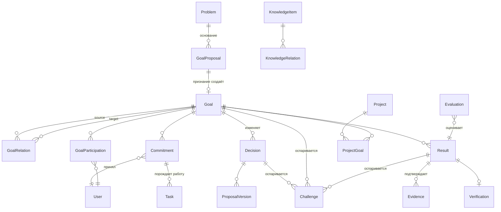

# Доменная модель CAOS 0.2

Статус: черновик для ревью (Track B). Основание: онтология (`docs/concept/ontology.md`), инварианты (`docs/concept/invariants.md`), критика проекта (разбор от 2026-09-12).

## Целевая ER-модель (ядро)

Ключевые различия с текущей схемой:

1. **Граф вместо дерева**: `GoalRelation` вместо единственного `parent_goal_id` (последний остаётся как сахар над `concretizes`).
2. **Процедура признания**: между Problem и Goal появляется GoalProposal; у цели — state machine.
3. **Человек ↔ цель напрямую**: `GoalParticipation` + `Commitment`, а не через Project/Team.
4. **Замкнутый цикл результата**: Result → Evidence → Verification → Evaluation.
5. **Project вторичен**: M2M `ProjectGoal`, проект не владеет людьми.

## Карта «текущее → целевое» по таблицам

| Текущая таблица | Решение | Целевое состояние | Трек |
|---|---|---|---|
| `users` | разделить | `UserIdentity` (email, пароль, сессии) + `UserProfile` (display_name, bio); email не покидает личных эндпоинтов | D2 |
| `auth_identities` | оставить | без изменений | — |
| `sessions` | оставить | без изменений | — |
| `problems` | расширить | + `situation`, `scope`; этап квалификации (proposed/qualified/rejected/deferred) | C2 |
| `goals` | расширить | + `current_state`, `target_state`, `scope`, `constraints`, `superseded_by`; state machine статусов | C2 |
| — | добавить | `goal_proposals` (предложение цели до признания) | C2 |
| — | добавить | `goal_relations` (типизированный граф) | C1 |
| `decisions` | расширить | + `target_type/target_id`, `valid_until`, `review_at`; честные методы уже внедрены | C6 |
| `decision_events` | оставить | + типы `argument/objection/alternative/revision` | C6 |
| — | добавить | `proposal_versions` (версии предложения) | C6 |
| `votes` | оставить | секретность уже внедрена (агрегаты до финализации) | — |
| — | добавить | `challenges` (оспаривание Goal/Decision/Result) | C6 |
| `projects` | ослабить | связывается с целями через `project_goal` M2M; `goal_id` депрекируется | C7 |
| `project_members` | заморозить | вытесняется `goal_participation` | C3 |
| `tasks` | расширить | + `commitment_id`; создание без связи с целью запрещается инвариантом INV-2 (после миграции данных) | C4 |
| — | добавить | `goal_participations` (user ↔ goal, контекстная роль) | C3 |
| — | добавить | `commitments` (обязательства) | C4 |
| — | добавить | `results`, `evidence`, `verifications` | C5 |
| `knowledge_items` | расширить | связи `knowledge_relations` с problem/goal/decision/result | C7 |
| `teams`, `team_members` | заморозить | не развиваются, не удаляются; новая функциональность не строится | — |
| `competences` | оставить | связывание с целями через требования задач; видимость ограничена | C4 |
| `notifications` | оставить | семантические типы позже | — |
| `audit_events` | оставить | append-only; история объекта по `entity_id` | D4 |
| `ai_suggestions` | эволюционировать | `ai_proposals`: model/version, input_snapshot, proposed_change, reviewed_by | G1 |

## Принципы миграции

1. **Только вперёд, без переписывания**: каждая ступень — отдельная Alembic-миграция, старые эндпоинты продолжают работать (новые сущности добавляются, старые связи депрекируются, а не удаляются).
2. **Данные не теряются**: существующие `project_members` конвертируются в `goal_participations` через `projects.goal_id`; существующие `goals.status='draft'` остаются валидным состоянием новой state machine.
3. **Каждая миграция сопровождается тестами инвариантов** (см. `docs/concept/invariants.md`).
4. **Порядок**: C1 (граф) → C2 (жизненный цикл) → C3 (участие) → C4 (обязательства) → C5 (результаты) → C6 (решения как процесс) → C7 (связности).
